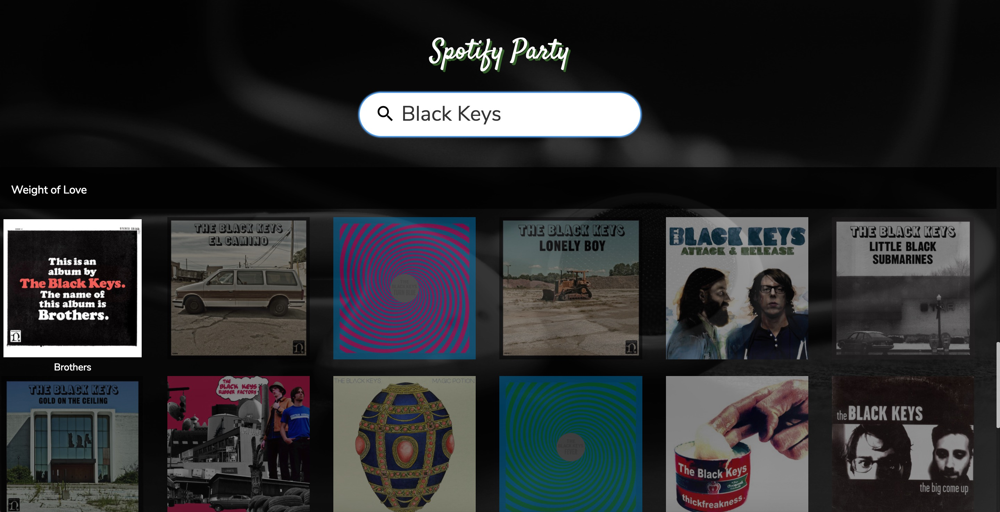

#Spotiparty
##Description
Spotiparty is an app that accesses the Spotify-API. You can enter a Searchterm and press Enter. At the moment, you will get the Albums (including Pictures) and Tracks associated with that Term. Later, it should allow users at a party to queue Tracks into a Party Playlist.
##Usage
Simply clone this repository and doubleclick on the index.html.
##Screenshot

